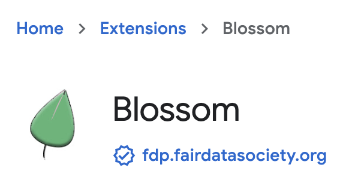

# Blossom

## Official [link](https://chrome.google.com/webstore/detail/blossom/caedjloenbhibmaeffockkiallpngmmd) to chrome web store



[Fair Data Protocol](https://fairdataprotocol.bzz.link/) Browser Extension.

The Blossom acts as a web3 framework for dApps and a [Fair Data Society account](https://github.com/fairDataSociety/FIPs/blob/master/text/0013-iaas.md) manager for end-users.

If you are a developer, read more about how to interact with the Blossom extension in its [javascript library documentation in the `library` folder](library/README.md)

## Configuration

Before running the extension, it should be configured so it can be properly built and executed.

All configuration is stored inside the `.env` file, in the root directory. That file should be created first. There is the template `.default.env` file which can be used for start. The configuration properties are:

- **ENVIRONMENT** - It can be set to `production` or `development` and determines how the project will be built.
- **SWARM_EXTENSION_ID** - This ID is used to establish communication with the Swarm extension in development mode.

## Installation

The extension is built by running this command:

```sh
npm run build
```

All compiled files will be generated in the `dist` directory.

To load the extension in Chrome browser:

- Open a new tab, type `chrome://extensions` in address bar and go to that page
- Enable development mode in the top right corner
- Click on the `Load unpacked` button and select the `dist` folder
- The extension should appear in the list of installed extensions

> **_NOTE_:** At the moment, only Chrome browser is supported

## Setting up the environment

### Swarm extension

In order to properly use the extension locally or to run tests, the required environment must be executed first.

The [Swarm extension](https://chrome.google.com/webstore/detail/ethereum-swarm-extension/afpgelfcknfbbfnipnomfdbbnbbemnia) must be installed in the same browser as where the Blossom extension. You can install it from the browser's extension store page, or you can build it locally.

To build and run a local version of the Swarm extension check [the extension's repo`](https://github.com/ethersphere/swarm-extension) or execute the following script from the root directory:

```bash
./scripts/compile-swarm-extension.sh
```

> **_NOTE_:** If you plan to run tests, compiling the Swarm extension using this script is required.

This script will generate the `swarm-extension` directory inside the root directory. You can load the compiled Swarm extension the same way as the Blossom extension by loading the `swarm-extension/dist` directory. Check the [Installation](#installation) section for the details how to load the extension.

> **_NOTE_:** If you are running your version of the Swarm extension, the `.env` file should be updated with its extension ID.

### FDP Play

The Blossom extension requires a blockchain RPC provider along with a Swarm gateway. For development purposes it is recommended to use [fdp-play](https://github.com/fairDataSociety/fdp-play).

To install the environment:

```bash
$ npm install -g @fairdatasociety/fdp-play
```

Then to run it:

```bash
fdp-play start
```

This environment will run a local bee node in development mode, on default ports `1633` and `1635` for debug API. Also an instance of the [fdp-contracts](https://github.com/fairDataSociety/fdp-contracts) image will be started.

> **_NOTE_:** For more options check the [fdp-play repository](https://github.com/fairDataSociety/fdp-play).

#### Bee postage batch

There must be at least one postage stamp created. To create a postage stamp in the Bee node, run:

```bash
curl -s -XPOST http://localhost:1635/stamps/10000000/18
```

### Development

To start the project in development mode execute this command:

```sh
npm start
```

This process will watch for changes in source files and compile files on every change.

### Tests

Tests include both unit and integration tests.

Unit test folder structure replicate source folder structure. For example, if there is a file in the `src` folder with the path `src/a/b/c.ts` its unit test will be in the path `test/a/b/c.spec.ts`.

Integration tests are located directly in the `test` directory. These tests use [Puppeteer](https://github.com/puppeteer/puppeteer) library to test the extension in a real browser.

In order to successfully execute tests, all the dependencies must be started. Check the [Setting up the environment](#setting-up-the-environment) section for detailed instructions.

Once when the complete environment is running, execute:

```sh
npm test
```

> **_NOTE_:** Tests rely on fresh state of the running services. If tests need to be run more than once, then all docker containers must be restarted as well.

## Architecture

There are three different environments in which the code is executed:

- **Content scripts** \
  Located inside the `src/content` directory. This code is injected into web pages and can access various page's resources such as DOM, window object, etc.
- **UI pages** \
  All UI pages are located inside the `src/ui` directory. For each directory there, a separete HTML and JavaScript file is generated, except for the `common` directory. Those HTML/JS files are used as UI components inside the extension.
- **Service worker** \
  All the other code is bundled into one script and executed as a service worker script. That code sets listeners that respond to various events.
